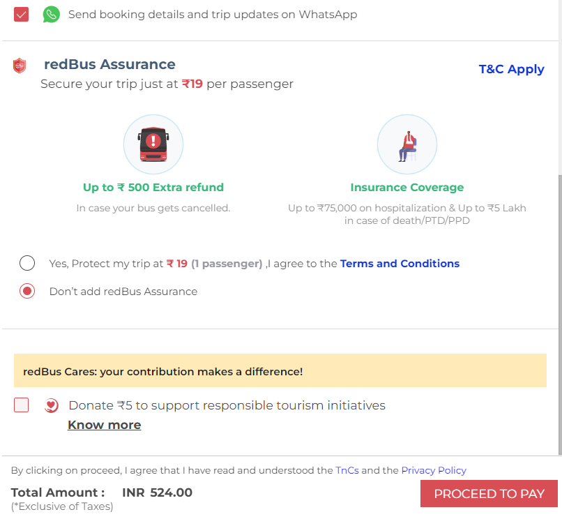

# Online Railway Commodity Reservation System (Trailgo)

Trailgo is an innovative online platform designed to simplify and enhance the cargo booking process for railway transportation. It provides a seamless interface for users to reserve, track, and manage commodity shipments across various railway networks. Trailgo caters to multiple user types, including admins, ticket managers, and customers, offering features such as real-time 
booking availability, cargo tracking, secure payment handling, and an advanced fraud reporting system. The platform's primary objective is to optimize cargo logistics, reduce manual inefficiencies, and promote transparency. With its user-friendly design, Trailgo aims to revolutionize the railway commodity reservation experience.


Go through: [Canva PPT](https://www.canva.com/design/DAGLgAmP4Qg/JO3mIcuB0Mt88famxqPO_g/view?utm_content=DAGLgAmP4Qg&utm_campaign=designshare&utm_medium=link&utm_source=editor)


## Booking 

The form should contain the following:

- Starting point (Semantic Search)
- Destination point (Semantic Search)
- Date of journey
- Goods 
- Quantity 

Output:

-> `Show the list of the trains`

TrainCard.tsx - 

```
Train No
Train Name
Path
Available Space
Fare
Rating
```

-> `Select a train 'ID'`

TrainDetailsAndReservation.tsx

```
Train Details with Pics
SVG Seat Allocation + Updation + Cart Analysis (Fare Updation)
Security (+Rs 5)

Proceed to Stripe
```
Security -> 



Output ->

- `Ticket`

Ticket.tsx

```
Ticket ID
Train Details
Compartments
Fare Receipt
```

-> `Cancel\Update Booking`

-> `Track Booking`

-> `Notify Me Checkbox`

## Booking History

## Track Shipment

-> `Select Train 'Id'`

Output:

-> `Stations passed`: Updated by every station master

-> `Live Map`

## Manager - List of Trains

-> `List of trains on that day with number of bookings of that train + Last passed station` 

-> `Arrived trains + Departed Option modification`

## Manager - Train Details

-> `Analysis Graph of train`

## Manager - Departure Station

-> `Contact Owner + Shipment success (No failure)`


Many are to be listed too !
